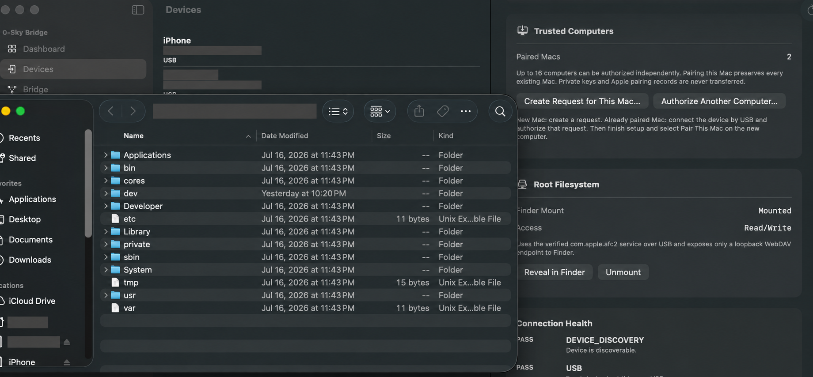
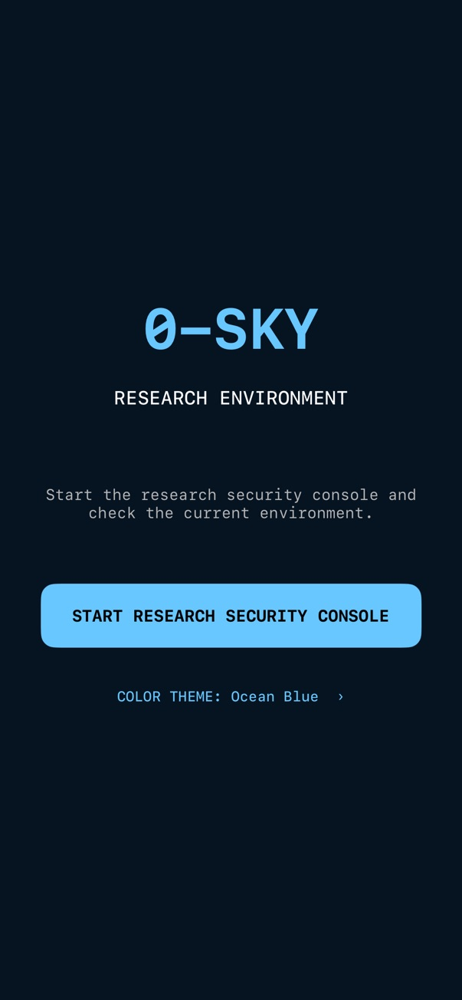
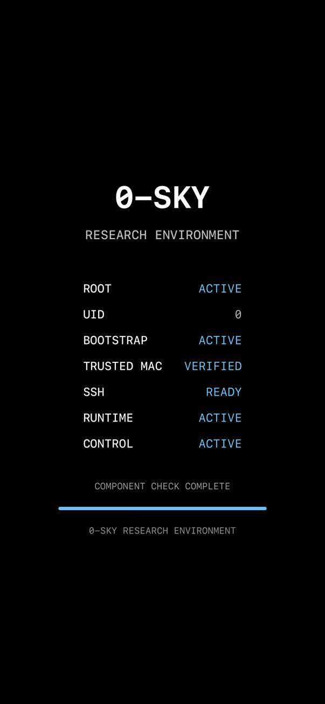
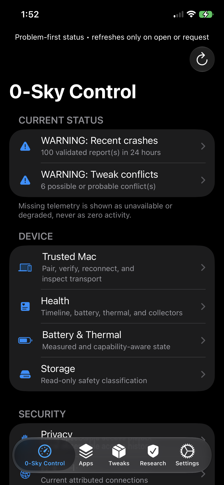
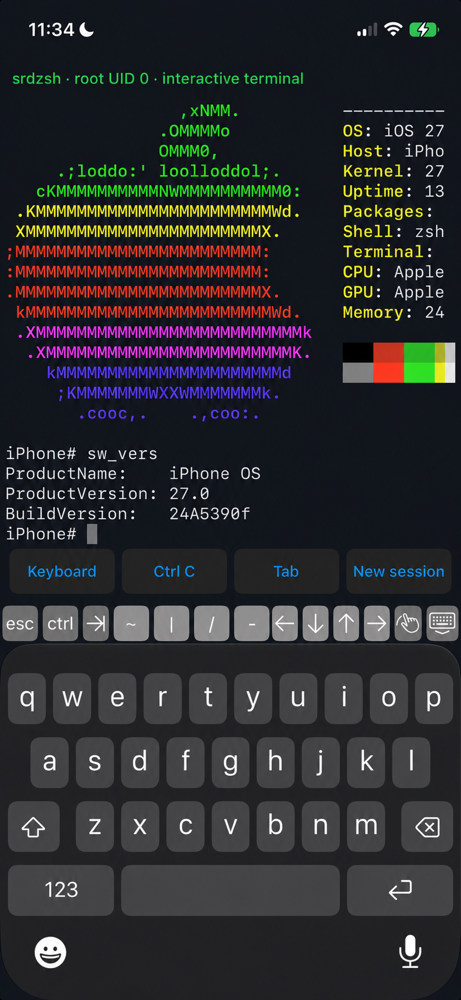
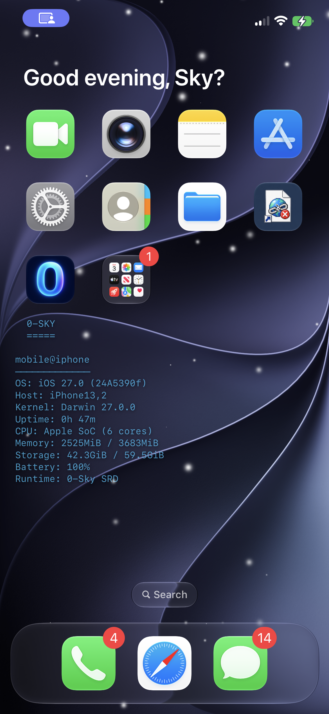

# 0-Sky

Note: This is a work in progress and the building blocks for where the project is currently.

## Current Supported Release

**CURRENT / VERIFIED / SUPPORTED:**
[`v1.0.0-pre.26`](https://github.com/fuzzlove/0-Sky/releases/tag/v1.0.0-pre.26)

Use only the package and three verification files attached to that release.
It is the sole release that passed the current independent release verifier and
the complete Intel-host/iOS 27 SRD package UAT. Verify the downloaded four-file
set before opening the installer.

Every earlier release is **DEPRECATED / UNSUPPORTED / DO NOT USE**. Historical
tags and release notes remain available for provenance, but known-broken binary
installers have been removed from public distribution. Do not install packages
marked deprecated, unsupported, withdrawn, test, development, or experimental.
See [`docs/RELEASE_POLICY.md`](docs/RELEASE_POLICY.md) and the
[`release cleanup report`](docs/RELEASE_CLEANUP_REPORT.md).

0-Sky is an authorized Apple Security Research Device control plane. This
repository publishes the source for the three first-party applications:

- [`bridge/`](bridge/) — 0-Sky Bridge for macOS
- [`link/`](link/) — 0-Sky Link for iOS/SRD
- [`control/`](control/) — 0-Sky Control for iOS/SRD

Installation, access, and use are governed by the
[`0-Sky End User License Agreement and Authorized Security Research Terms`](bridge/0SkyBridge/Resources/Legal/EULA.md).
Its independent version and effective date are in the adjacent `EULA.json` manifest. The Bridge installer and first-run
application flow require explicit agreement and authorization certification.

The source tree deliberately excludes device identifiers, pairing records,
credentials, tokens, SSH keys, provisioning profiles, certificates, research
sessions, logs, compiled applications, and device-derived evidence.

## Installation

The recommended user path is a verified, signed Universal 2 macOS package.
Follow [`INSTALL.md`](INSTALL.md), verify the four-file release set before
opening the package, then use **Install All 0-Sky Requirements** inside Bridge.
The installer discovers Intel or Apple-silicon tools at runtime, maintains an
isolated pinned Python environment, and requires explicit selection and
verification of the exact connected SRD.

A source checkout is not a complete installer: authorized Apple assets, signed
device payloads, the offline wheelhouse, and publisher credentials remain
external. Developers should use [`BUILDING.md`](BUILDING.md); release engineers
should use only [`scripts/build_release.sh`](scripts/build_release.sh) and the
procedure in [`RELEASE.md`](RELEASE.md). See
[`docs/TROUBLESHOOTING.md`](docs/TROUBLESHOOTING.md) for repair and uninstall,
and [`docs/SUPPORTED_PLATFORMS.md`](docs/SUPPORTED_PLATFORMS.md) for the
evidence-scoped compatibility matrix.

Before building, run the human-readable doctor. Every missing mandatory item
is printed with the exact installation or repair command; it never reports only
"dependency missing":

```sh
python3 tools/environment_preflight.py --human --mode development \
  --kit "/absolute/path/to/authorized kit" \
  --theos "/absolute/path/to/locked/theos" --skip-device
```

## Screenshots

The root-filesystem image is a public redacted copy with the operator name and
device-unique identifiers removed. It shows the interface state only and does
not identify which experimental AFC2 package variant is installed.

[](docs/assets/root-filesystem-mounted-redacted.png)

<p align="center">
  <a href="docs/assets/research-environment-launch.jpeg"></a>
  <a href="docs/assets/research-environment-active.jpeg"></a>
  <a href="docs/assets/control-dashboard-status.png"></a>
</p>

<p align="center">
  <a href="docs/assets/srdzsh-interactive-terminal-redacted.png"></a>
  <a href="docs/assets/0-sky-srd-home-screen.png"></a>
</p>

## Requirements

See [`REQUIREMENTS.md`](REQUIREMENTS.md) for complete host, SDK, dependency,
device, signing, and runtime requirements. Each component also has its own
README with exact build commands.

The binary Bridge release provides **Install All 0-Sky Requirements** in the
GUI. Its guided installer uses the embedded, hash-verified Intel/Apple-silicon
Python 3.12 runtime plus built-in `dpkg-deb`, USB listing, and USB forwarding
compatibility helpers. It does not require Homebrew or a developer Python.

## Quick source checks

```sh
python3 tools/pii_audit.py .
(cd bridge && swift build -c debug)
(cd bridge && swift run BridgeCoreTests)
python3 control/TrollStoreLite/tests/test_device_compatibility.py
```

Building the device applications requires the Apple iPhoneOS SDK and the
researcher-provided signing/authorization environment described in the
requirements. This repository does not contain Apple-provided SRD assets or
any reusable signing credential.

## Releases

The supported download is
[`v1.0.0-pre.26`](https://github.com/fuzzlove/0-Sky/releases/tag/v1.0.0-pre.26).
A downloadable artifact is acceptable only when its `RELEASE_MANIFEST.json`,
`SHA256SUMS`, and `RELEASE_AUDIT.txt` verify. Source tags do not imply that a
binary installer passed distribution signing, notarization, clean-machine, or
hardware tests. Older releases are retained only as deprecated historical
records and are not installation sources.

A complete development candidate can assemble its host runtime automatically.
Public distribution still requires reviewed replacement device payloads plus
the publisher's Developer ID and notarization credentials; the release gate
prints those external actions explicitly and does not claim success early.

## Security and privacy

Use only with devices and systems you own or are explicitly authorized to
research. Review [`SECURITY.md`](SECURITY.md) and [`PRIVACY.md`](PRIVACY.md).
The current cleanup findings, retained uncertainties, removed files, executed
validation, and release blockers are recorded in
[`docs/REPOSITORY_AUDIT.md`](docs/REPOSITORY_AUDIT.md).

## Attribution and licensing

0-Sky Control is derived from TrollStore and retains its upstream GPL license
and attribution in [`control/LICENSE`](control/LICENSE). Other bundled or
external dependencies retain their respective upstream licenses. Publication
of source does not redistribute Apple SDKs, Apple SRD tooling, private keys,
provisioning profiles, or third-party binary payloads.

## Multiple trusted Macs per SRD

0-Sky Bridge supports up to 16 independent computers for one authorized SRD.
On a new Mac, choose **Devices > Multiple Computers > Create Request for This
Mac…**. On an already paired Mac, connect the exact device by USB and choose
**Authorize Another Computer…**. Then complete Apple's Trust/Developer Paired
Macs flow and **Pair This Mac** on the new computer. The signed transfer request
is device-bound, expires after seven days, and contains public keys only;
existing Mac registrations are preserved during the schema-2 migration.

## Full-disclosure security diagnostics

0-Sky Bridge publishes the complete method and redacted result for every
security diagnostic. Unmeasured checks are explicitly `NOT_RUN`, and exports
include a versioned disclosure catalog plus SHA-256 integrity hashes. See the
[Bridge diagnostic specification](bridge/docs/DIAGNOSTICS.md).
